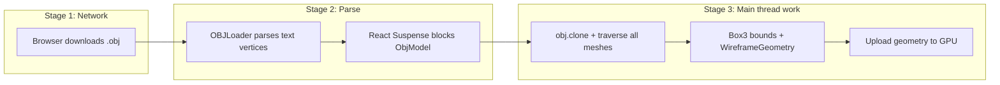
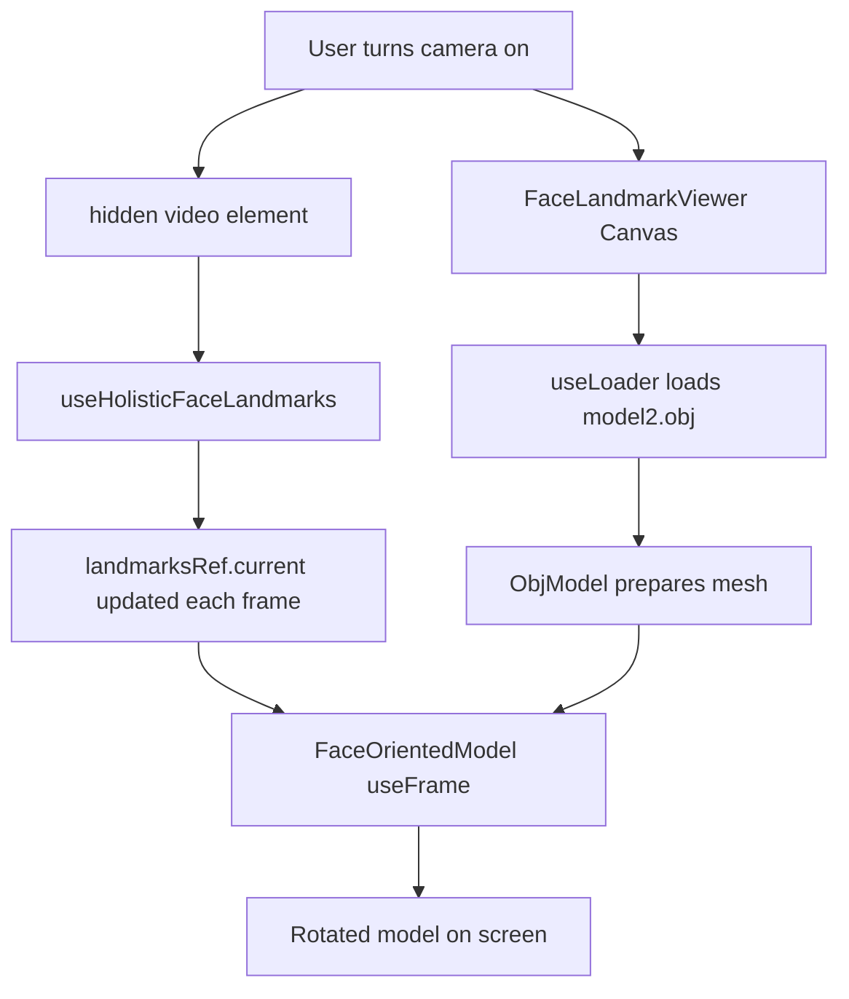

# How model2.obj Size Affects Your Web App

Following your [.cursorrules](.cursorrules) mentoring style: **problem first**, **concepts**, **data flow**, **what was solved**, **what remains**.

---

## 1. The problem you were solving

Your video frame renders a 3D sunglasses model inside [FaceLandmarkViewer.jsx](src/components/FaceLandmarkViewer.jsx). That model is not part of React — it is a **separate asset file** fetched over HTTP and parsed in the browser.

Current assets in [public/models/](public/models/):

| File | Size | Used in code? |
|------|------|----------------|
| `model.obj` | ~22 MB | Preloaded in [index.html](index.html), but **not** loaded by app anymore |
| `model2.obj` | ~14 MB | **Yes** — `MODEL_PATH = '/models/model2.obj'` |
| `model2.glb` | ~4.3 MB | **No** — best size, not wired up yet |

So when you said “the model appeared after a few seconds, but not in incognito,” that matches a **large-file + no-cache** problem, not necessarily broken code.

---

## 2. Why file size hurts the web (concepts)

A 14–22 MB OBJ creates pain at **three stages**:

### Stage 1 — Download (network)
- Browser must fetch the entire file before parsing starts.
- **Normal window**: HTTP cache helps on repeat visits → model shows faster after first load.
- **Incognito**: no cache → full 14 MB download every time → much slower or appears “stuck.”

### Stage 2 — Parse (OBJ format penalty)
- OBJ is **plain text** — larger on disk and slower to parse than binary formats like **GLB**.
- [useLoader(OBJLoader, MODEL_PATH)](src/components/FaceLandmarkViewer.jsx) suspends the component until parsing finishes (`Suspense`).

### Stage 3 — CPU work after load ([ObjModel](src/components/FaceLandmarkViewer.jsx))
After load, your code still does expensive work on the main thread:
- `obj.clone()`
- `clone.traverse()` to assign materials to every mesh
- `Box3.setFromObject()` twice (before/after scale)
- Builds a red wireframe box helper

With ~384k lines in `model2.obj`, that post-processing can **freeze the tab briefly** even after the download completes.

### Hidden visibility (looked like “not loading”)
Originally, the model group was only visible when MediaPipe detected a face. So even after a successful load, you could see a **dark canvas** until:
1. Model finished loading, **and**
2. Camera + face tracking were working, **and**
3. Your face was in frame

That felt like “model never loads” when it was actually “loaded but invisible.”

---

## 3. Data flow: from camera to visible model

**Key idea:** loading the model and detecting your face are **two independent pipelines**. Both must succeed for the full experience (rotating sunglasses).

---

## 4. What was done to solve / mitigate it

These were **reliability and UX fixes** — they do not magically make 14 MB small, but they make the behavior understandable and less fragile.

### A. Loading feedback — [ModelLoadProgress](src/components/FaceLandmarkViewer.jsx)
- Uses `useProgress()` from `@react-three/drei` to show a **percentage bar** while the asset loads.
- **Why:** Before this, `Suspense fallback={null}` meant a blank dark screen with no explanation.

### B. Load failure handling — [ModelErrorBoundary](src/components/FaceLandmarkViewer.jsx)
- Catches loader failures and shows “Model failed to load.”
- **Why:** In incognito / bad network, failed fetches fail silently without this.

### C. Show model before face lock — [FaceOrientedModel](src/components/FaceLandmarkViewer.jsx)
- Changed so `group.visible = visible` (model shows when loaded).
- Rotation still waits for landmarks (`if (!hasRequiredLandmarks) return`).
- **Why:** You can now see the model is loaded even while waiting for face tracking.

### D. Face tracking hint — [MediaPipeHolisticCanvas.jsx](src/components/MediaPipeHolisticCanvas.jsx)
- Shows “Point your face at the camera” when camera is on but `isTracking` is false.
- **Why:** Separates “model loading” from “MediaPipe not seeing you yet.”

### E. Tracking startup fix — [useHolisticFaceLandmarks.js](src/hooks/useHolisticFaceLandmarks.js)
- Removed early exit when `videoRef.current` was null on first effect run; loop waits for video readiness instead.
- **Why:** Prevents Holistic from never starting if the video ref wasn’t ready immediately.

### F. Video mount order — [App.jsx](src/App.jsx)
- `<video>` moved **before** `MediaPipeHolisticCanvas` so the camera stream ref exists earlier.

### G. Preload hint — [index.html](index.html)
- Added `<link rel="preload" href="/models/model.obj" ...>` to start download sooner.
- **Note:** This is now **out of sync** — app loads `model2.obj`, preload still points at `model.obj`.

---

## 5. What is NOT fully solved yet (honest technical debt)

| Issue | Status |
|-------|--------|
| File still large (14 MB OBJ) | Partially improved vs 22 MB; still heavy for web |
| Better format available (`model2.glb` 4.3 MB) | Not used — biggest win still on the table |
| Preload points at wrong file | [index.html](index.html) still preloads `model.obj` |
| Loading hint text | Still says “~22MB” in UI — stale after switch to `model2.obj` |
| OBJ post-processing cost | Still clones + wireframe box on huge mesh every load |

---

## 6. How this would scale in production

Industry-standard approach for web 3D:

1. **Use GLB/GLTF**, not OBJ (you already have `model2.glb` at 4.3 MB).
2. **Target under ~5 MB** for interactive pages; use Draco compression if needed.
3. **CDN + cache headers** so repeat visits are fast.
4. **Progressive loading**: show lightweight placeholder (arrow/grid) immediately; swap in model when ready — you partially do this now.
5. **Avoid extra geometry work on load** (e.g. red bounding box wireframe on a 14 MB model) unless needed for debug.

---

## 7. Mental model to keep

> **Large model file → slow download → slow parse → slow JS post-process → delayed or invisible render.**

Your fixes mainly addressed **“invisible”** and **“no feedback”** — the right first step for debugging. The **structural** fix for speed is switching to [model2.glb](public/models/model2.glb) with `useGLTF` from drei (roughly 3× smaller than `model2.obj`).

---

## Suggested next steps (when you want to implement)

1. Switch loader from `OBJLoader` + `model2.obj` → `useGLTF` + `model2.glb`.
2. Update [index.html](index.html) preload to match the file you actually load.
3. Update loading hint text to reflect real file size.
4. Optionally remove or gate the red wireframe box helper in production builds.

If you want to proceed with the GLB migration, say so and we can walk through it step-by-step (concepts first, code second — per your `.cursorrules`).
